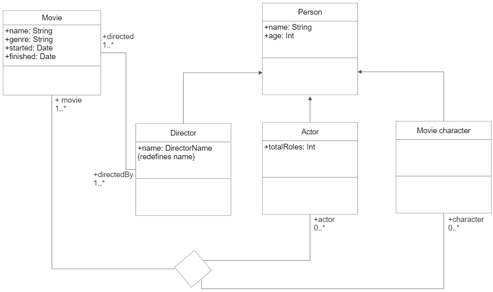

# UML

Vytvořil jsem model jednoduché filmové databáze obsahující 5 tříd: Film (Movie), Osoba (Person), Režisér (Director), Herec (Actor) a Filmová postava (Movie character).

UML diagram je v souboru [UML.png](UML.png): 

I) Ternární vztah
- ternární vztah je mezi filmem, hercem a postavou, kterou v daném filmu daný herec hrál

II) Specializace/generalizace
- z generické třídy Person dědí třídy Director, Actor a Movie character

III) Redefinice/restrikce property
- property `name : DirectorName` ve třídě Director redefinuje property `name : String` ze třídy Person

# OCL

I) Datum začátku natáčení filmu není starší než datum dokončení tohoto filmu
```
context Movie
inv: self.started <= self.finished
```

II) Věk každé osoby je nezáporný
```
context Person
inv: self.age >= 0
```

III) Filmy každého režíséra mají neprázdný název
```
context Director
inv: self.directed->forall(m | m.name != "")
```